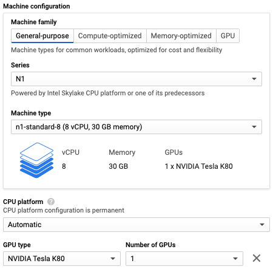
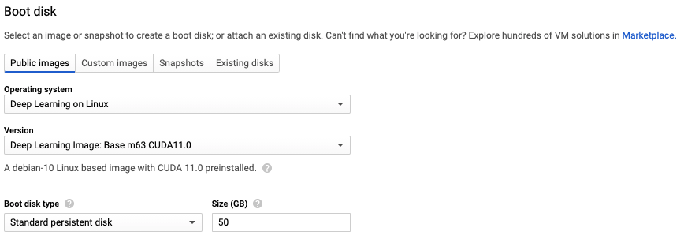

# Beaker

[Beaker](https://beaker.org) is a collaborative platform for rapid and reproducible research.

## Getting Started

1. Create an account at [beaker.org](https://beaker.org)
   and follow the instructions in your [account settings](https://beaker.org/user).  If you are
   an AI2 employee please use Google OAuth and your AI2 account.

   These instructions will guide you through installing and configuring the
   Beaker CLI. See [below](#install-beaker-cli) for more options.

   If you signed up using your @allenai.org email address, then you should
   automatically have credentials.  Otherwise you will need to
   request credentials to run an experiment from a Beaker admin.
   You can either ask on #beaker-users or email bunsen@allenai.org.
   Please include the email address associated with your Beaker account.

2. Run your first experiment. The following example
   [counts words](https://beaker.org/im/im_qbjvcda1sed7) in the text
   of [Moby Dick](https://beaker.org/ds/ds_1hz9k6sgxi0a).

   ```bash
   cat > count.yaml << EOF
   tasks:
   - spec:
       image: examples/wordcount
       resultPath: /output
       datasetMounts:
       - datasetId: examples/moby
         containerPath: /input
   EOF
   ```

   ```bash
   beaker experiment create -f count.yaml
   ```

3. For more in-depth documentation, see https://github.com/beaker/docs.

## Installation

### Prerequisites

[Docker](https://www.docker.com/) is the foundation for Beaker experiments and
must be installed to take full advantage of Beaker.

### Install Beaker CLI

The most direct way to install Beaker is to download a
[release](https://github.com/allenai/beaker/releases) and extract it to your path.

```bash
tar -xvzf beaker_*.tar.gz -C /usr/local/bin
```

OS X users can install Beaker through [Homebrew](https://brew.sh/) with a custom tap.


```bash
brew tap allenai/homebrew-beaker https://github.com/allenai/homebrew-beaker.git
brew install beaker
```

Beaker can also be installed from source using standard [Go](https://golang.org/) tools.

```bash
go get -u github.com/allenai/beaker/...
```

## Executor

The Beaker executor runs Beaker jobs.
If you want to run Beaker jobs on your own machines, you can install the Beaker executor.

### Prerequisites

The Beaker executor is only supported on Linux.
It requires [Docker](https://docs.docker.com/engine/install/)
and the [NVIDIA Container Toolkit](https://docs.nvidia.com/datacenter/cloud-native/container-toolkit/install-guide.html)
if using GPUs.

### Installation

Each executor belongs to a cluster.
A cluster is a grouping of machines used for scheduling tasks.
If a task is scheduled to a cluster, it may run on any of the machines in that cluster.

You may choose an existing cluster from the existing [on-premise clusters](https://beaker.org/clusters) or create a new one.
Clusters are scoped to an account.
If you would like your cluster to only be usable by you, create it under your personal account e.g. `my-name/my-cluster`.
If you would like your cluster to be usable by others in your organization,
create it under the organization's account e.g. `ai2/my-cluster`.

```
beaker cluster create <account>/<name>
```

Next, install the executor:

```
beaker executor install <cluster>
```

When creating new experiments, specify the `cluster` property in each task
and they will run on your machine.

```yaml
tasks:
- context:
    cluster: <cluster>
```

### Management

See `beaker executor -h` for all available executor management commands.

The executor is run through the `beaker-executor` systemd service
so all systemd commands are available.
Some useful ones include `systemctl status beaker-executor` to see if the executor is running
and `journalctl -u beaker-executor` to see the executor's logs.

### Installation on Google Cloud

If you need to run an experiment in a zone other than us-west1-b (Beaker's zone)
or use a machine configuration that Beaker doesn't support,
you can run the Beaker on your own Google Cloud VM instance.

#### Create an Instance

First, go to the [instance creation page](https://console.cloud.google.com/compute/instancesAdd)
and select a name and region for your instance.
Machines in us-west1-b will have the best performance because that is where
the Beaker API is hosted and where Beaker datasets are stored.

Next, configure your machine.
If using a GPU, you must select the "N1" series under "Machine configuration".
GPUs are not available with other series as of 2/12/2021.



Finally, change the boot disk.
Google provides images that already have the prerequisites for Beaker installed:
Docker, CUDA drivers, and the NVIDIA Container Toolkit.


Select the "Deep Learning on Linux" operating system
and the "Deep Learning Image: Base m63 CUDA11.0" version.
Other versions with PyTorch and Tensorflow are also available but these are not necessary
because those libraries are already included in the Beaker images.



Click "Create" and wait for your instance to come up.

#### Connect to the Instance

The easiest way to connect to the instance is with SSH through the
[gcloud command](https://cloud.google.com/sdk/gcloud).

You may need to be on the VPN and use the `--internal-ip` flag depending on how
networking is configured for your Google Cloud project.

```
gcloud compute ssh <instance>
```

When prompted to install the NVIDIA drivers, select yes.

#### Installing the Beaker CLI

Download the CLI:

```bash
curl -s https://api.github.com/repos/allenai/beaker/releases/latest \
| grep "beaker_linux.tar.gz" \
| cut -d : -f 2,3 \
| tr -d \" \
| wget -qi -
```

Extract it to your path:

```bash
sudo tar -xvzf beaker_linux.tar.gz -C /usr/local/bin
```

Now, you should be able to run `beaker`.

#### Installing the Beaker Executor

Run the following command to install the executor:

```
sudo beaker executor install <cluster>
```

More detailed instructions are available [here](#installation-1)

## Notices
[Beaker dependencies and licenses](https://app.fossa.io/attribution/a462337b-67c8-418e-8a05-9b6f67de4626)
