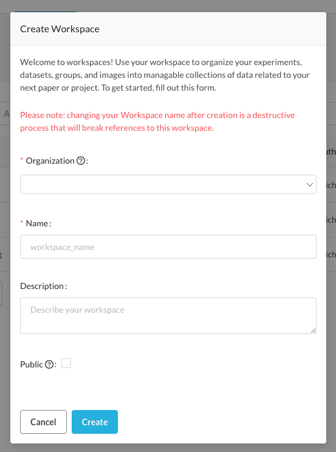
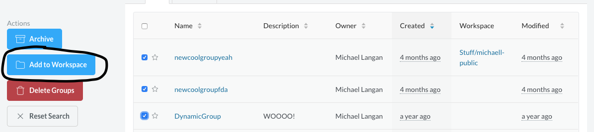
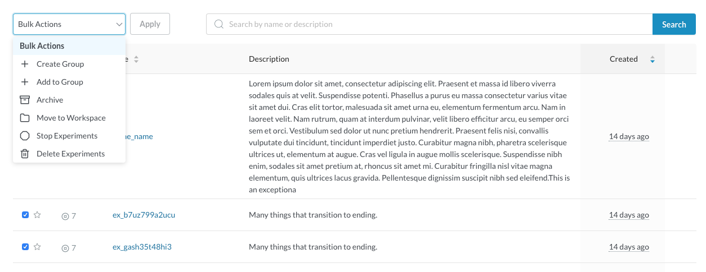

# Beaker Workspaces

Workspaces are a new feature making it easier to organize and share your work. Datasets, experiments, groups, and images can all be collected into workspaces. You may want to keep together the work related to a particular paper submission, for example, or perhaps create a set of datasets to share among your colleagues.

## Creating a Workspace
You can create and explore workspaces by clicking on the new “Workspaces” link in the top bar. Workspaces are scoped to users and organizations, and the org selector at the top right can be used to switch contexts. For example, you may choose to put “throw-away” work into a workspace in your personal org, and datasets you want to share with colleagues in a workspace under the AI2 organization.

1. Click on Workspaces in the top bar.
1. Click the Create New Workspace button. This modal will appear: 
   
   1. Select the organization under which you want to create the workspace. The "Personal" organization is by default private to you. Creating a workspace under an organization will by default be readable by others members of that organization.
   1. Carefully choose a new name for the new workspace. Names are unique within the context of an organization, and while the name can be changed later, that action will break any existing references. (e.g. mentions in papers or tweets, recording links in documents, etc.)
   1. Optionally write a description for the workspace.
   1. If you wish to make this workspace and its contents publicly accessible to anyone with the link, check the Public checkbox.
   1. Click Create to create the workspace.
1. If you do not see the new workspace in the list, double-check the selected organization in the upper right. This menu controls which organization's workspaces you view.

## Putting Items in Workspaces
### At Creation Time
The `create` CLI commands for datasets, experiments, groups, and images accept a `--workspace` flag where you can specify the workspace. Remember that workspaces are scoped to organizations or users, so `my-workspace` in the `ai2` organization is referenced by `ai2/my-workspace`.

### Moving Existing Items
You can move existing items into workspaces either through the CLI or through the Beaker UI. Items can only belong to one workspace at a time.

To move items using the CLI, use the `workspace move` command supplying a workspace followed by a list of IDs to move into that workspace. There are two bash scripts to assist with moving experiments and groups, because those have related items which you may want to move as well.
- workspace-move-group.sh https://gist.github.com/mjlangan/83b145febdd7159c7575004dd7b3d110
- workspace-move-experiment.sh https://gist.github.com/mjlangan/c53c3cac92cde8bf5c7b6bfe57916bda

In the UI, to move items into a workspace for the first time, select the datasets, experiments, or groups you wish to move on their respective search pages. Once at least one item is selected, there will be a Add to Workspace action on the left side of the page.

To move items between workspaces, navigate to the source workspace, select the items you wish to move using the checkboxes, and, in the Bulk Actions dropdown, select Move to Workspace and click Apply.

## Permissions
Workspaces can have different permissions applied to them, which can be done through the Permissions tab if you have Full Control access to the workspace. The permissions assigned to a workspace will also control the accessibility of items within that workspace. For example, if user A grants user B write permission on their workspace, user B will also have write permissions on all items inside that workspace.

## Referencing Items in workspaces
In Q4/Q1, the Beaker team plans to revisit the way things are named. Until that happens, items in workspaces can be referenced the same way as before this feature released--by ID, or by `<account>/<name>`, where `<account>` is the owning user or organization.

## Feedback
User feedback is extremely important to the Beaker team and we encourage users to let us know how we can make features easier to use and more effective. The #beaker-users channel on Slack is a great place to provide feedback or ask for help. If you are uncomfortable raising the issue in a public Slack channel, you can contact the team via e-mail at beaker-eng@allenai.org.
